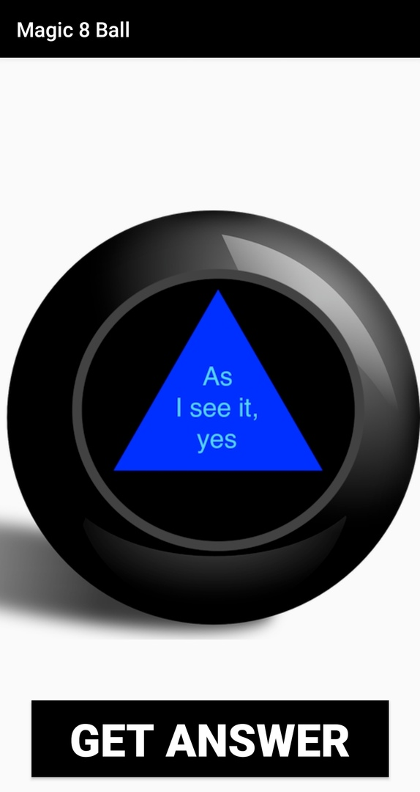

# Android-Magic-8-Ball
Android Magic 8 Ball app.

# What can it  do?
  - Shows randomized answer(Yes or No variations)

# What I learnt?
  - Kotlin basics
  
### Todos
 - Add device shake detection
 - Add language choice

# Portrait mode screenshot

**hello world:)**
